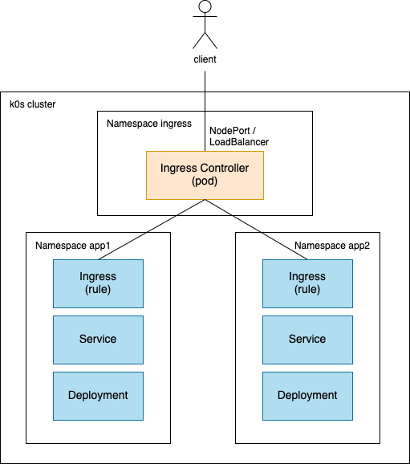
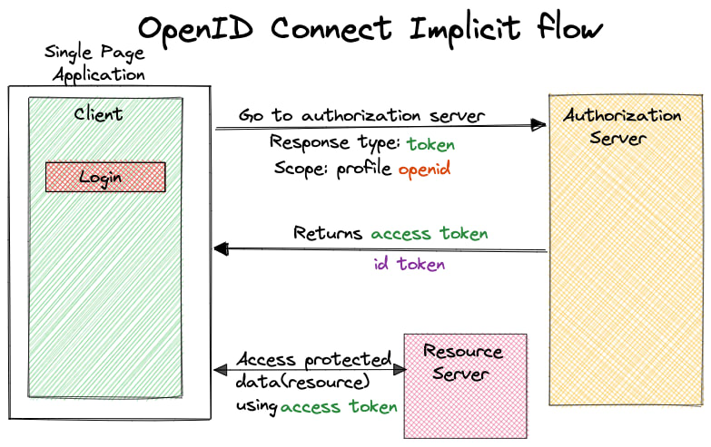

# Construisons ensemble de A à Z un cloud opensource pour le datascientist

Plan de jeu :

1. [Provisionner un cluster Kubernetes](#provisionner-un-cluster-kubernetes)
2. [Prise en main "admin" du cluster](#prise-en-main-admin-du-cluster)
3. [Datascience 101 : déploiement d'un service](#datascience-101--déploiement-dun-service)
4. [Packaging, reproductibilité et configuration : Helm](#packaging-reproductibilité-et-configuration--helm)
5. [Exposition des services vers l'extérieur](#exposition-des-services-vers-lextérieur)  
6. [Bilan d'étape](#bilan-détape)  
7. [Onyxia, notre sauveur](#onyxia-notre-sauveur)  
8. [Installation d'Onyxia](#installation-donyxia)  
9. [Multi utilisateurs : authentification](#multi-users--authentification)  
10. [Stockage S3](#stockage-s3)  
11. [Catalogue de services](#catalogue-de-services)  
12. [Gestion des secrets](#gestion-des-secrets)  
13. [Customisation](#customisation)

## Contexte et objectif

https://minio.lab.sspcloud.fr/projet-onyxia/diffusion/Presentation/devoxx-intro.pdf

## Provisionner un cluster Kubernetes

### `Théorie`

- Un prérequis : un cluster Kubernetes
- "Agnostique de la distribution / cloud provider"
- Aujourd'hui : cluster managé chez OVH

### `Pratique`

- Création d'un cluster Kubernetes sur OVH

## Prise en main "admin" du cluster

### `Théorie`


- Interaction avec l'API Server

### `Pratique`

- Installation de `kubectl` (https://kubernetes.io/docs/tasks/tools/), attention au [Version skew policy](https://kubernetes.io/releases/version-skew-policy/) : respecter `+/- 1` par rapport au cluster pour éviter les problèmes. Le mettre dans le `PATH`.
- Téléchargement du `kubeconfig` depuis l'interface du provider (ou récupération en fonction de la distribution), le placer dans `~/.kube/config`
- Confirmer avec `kubectl get nodes` la présence des noeuds

## Datascience 101 : déploiement d'un service

### `Théorie`

- On a un cluster, on déploie et c'est fini, non ?

### `Pratique`

- Déploiement d'un jupyter notebook basique. `kubectl apply -f manifests/jupyter-basique`
- `kubectl get pods` pour suivre la création du pod
- `kubectl logs podname` une fois `Running` pour consulter les logs et récupérer le token d'accès (on ne l'a pas précisé donc il est généré dynamiquement à chaque lancement)
- `kubectl port-forward podname 8888:8888` pour ouvrir un tunnel entre `localhost:8888` et le port 8888 du Jupyter
- Accès et utilisation du Jupyter via `localhost:8888`

Superbe infra datascience :thumbsup:

## Packaging, reproductibilité et configuration : Helm

### `Théorie`

Intérêt du packaging, principes de Helm

### `Pratique`

Désinstallation et réinstallation du service précédent

- `kubectl delete -f manifests/jupyter-basique` pour nettoyer le service précédent
- Recherche d'un `chart` Helm pour jupyterlab ...
- https://github.com/inseefrlab/helm-charts-interactive-services

```
helm repo add helm-charts-interactive-services https://inseefrlab.github.io/helm-charts-interactive-services
helm repo update
helm install jupyter helm-charts-interactive-services/jupyter-python
```

- Pratique : faire un `chart` "coquille" avec une dépendance vers le `chart` réel (cf `manifests/jupyter-helm`)
- Bonne pratique : Utiliser `helm template` AVANT d'installer pour contrôler ce qui va être installé. (à défaut, `helm get manifest <releasename>` pour voir les manifests après installation)
- Bonne pratique : Externaliser les values dans un `values.yaml` (`helm install -f values.yaml`)
- Bonne pratique : `helm uninstall jupyter`

## Exposition des services vers l'extérieur

### `Théorie`



### `Pratique`

- `cd manifests/ingress-nginx`, `helm dependencies build` pour télécharger les dépendances (`helm dependencies update` pour les mettre à jour)
- `kubectl create namespace ingress-nginx`
- `helm template ingress-nginx . -f values.yaml -n ingress-nginx` pour prévisualisation
- `helm install ingress-nginx . -f values.yaml -n ingress-nginx` pour l'installation
- `kubectl get pods -n ingress-nginx` pour suivre l'avancée des pods, `kubectl get service -n ingress-nginx` pour suivre l'affectation de l'IP loadbalancer
- Récupérer l'IP externe (après affectation par le cloud provider)

### `Théorie`

Une adresse IP c'est bien, un nom de domaine c'est mieux

### `Pratique`

- Configuration d'un champ DNS `A` `*.devoxx.insee.io` => `ipexterne`
- Modifier le jupyter pour utiliser le reverse proxy (`helm upgrade jupyter helm-charts-interactive-services/jupyter-python --set ingress.enabled=true --set ingress.hostname=devoxx.insee.io`)

### `Théorie`

- `HTTP` brut en 2023 :vomit:
- 2 approches : `cert-manager` et `wildcard`

### `Pratique`

- Wildcard (via [let's encrypt](https://letsencrypt.org/)) : `certbot certonly --manual --preferred-challenges dns`
- `kubectl create secret tls wildcard --key privkey.pem --cert fullchain.pem -n ingress-nginx`
- Ou cert-manager : https://cert-manager.io/docs/installation/helm/

## Bilan d'étape

On a un cluster, accessible aux admins avec possibilité de déployer des services de façon technique.  
**Nécessité d'industrialisation et de proposer une UX**

## Onyxia, notre sauveur

Vidéo + présentation de l'appli + démo sspcloud (J)

## Installation d'Onyxia

### `Théorie`

- https://www.onyxia.sh/
- Pattern "namespace as a service"

### `Pratique`

- `cd manifests/onyxia-brut`, `helm dependencies build`, `helm install onyxia . -f values.yaml -n onyxia --create-namespace`
- ...
- `https://datalab.devoxx.insee.io`

## Multi utilisateurs : authentification

### `Théorie`



### `Pratique`

Installation d'un [Keycloak](https://github.com/keycloak/keycloak)

- `cd manifests/keycloak`, `helm dependencies build`, `helm install keycloak . -f values.yaml -n keycloak --create-namespace`

* Interface d'admin : https://auth.devoxx.insee.io/auth
* Création d'un realm `datalab`, onglet `login` activation de `User registration`
* Création d'un client `onyxia` avec `Root URL` : `https://datalab.devoxx.insee.io`, `Valid redirect URIs` : `https://datalab.devoxx.insee.io/*` et `Web origins` : `+`

Configuration d'onyxia :

- `cd manifests/onyxia-oidc`, `helm dependencies build`, `helm upgrade onyxia . -f values.yaml -n onyxia`

## Stockage S3

### `Théorie`

Intérêt du stockage S3 (F)

### `Pratique`

Installation d'un [minIO](https://github.com/minio/minio)

- `cd manifests/minio`, `helm dependencies build`, `helm install minio . -f values.yaml -n minio --create-namespace`
- Utilisation de [mc](https://min.io/download#/linux)
- `mc alias set devoxx https://minio.devoxx.insee.io admin changeme`
- `mc admin info devoxx`
- `mc ls devoxx`

Authentification OpenIDConnect :

- Création d'un client `minio`, `Root URL` : `https://minio.devoxx.insee.io`, `Valid redirect URIs` : `https://minio.devoxx.insee.io/*` et `https://minio-console.devoxx.insee.io/*`, `Web origins` : `+`
- Ajout d'un mapper pour ce client : `clients` => `minio` => `client scopes` => `minio-dedicated` => `configure a new mapper` => `hardcoded claim` :  
   _ Name: `stsonly`
  _ Token claim name: `policy` \* Claim value : `stsonly`  
  Console disponible sur [https://minio-console.devoxx.insee.io](https://minio-console.devoxx.insee.io)

Intégration avec Onyxia :

- Création d'un client `onyxia-minio`, `Root URL` : `https://datalab.devoxx.insee.io`, `Valid redirect URIs` : `https://datalab.devoxx.insee.io/*`, `Web origins` : `+`
- Ajout d'un mapper pour ce client : `clients` => `onyxia-minio` => `client scopes` => `minio-dedicated` => `configure a new mapper` => `hardcoded claim` :
  - Name: `stsonly`
  - Token claim name: `policy`
  - Claim value : `stsonly`
- Ajout d'une audience spécifique pour ce client : `clients` => `onyxia-minio` => `client scopes` => `onyxia-minio-dedicated` => `add mapper by configuration` => `audience` :
  - Name: `audience-minio`
  - Included Custom Audience : `minio`
  - Add to ID token: `true`
- `cd manifests/onyxia-s3-minio`, `helm dependencies build`, `helm upgrade onyxia . -f values.yaml -n onyxia`

Minio intégré dans Onyxia :)

## Catalogue de services

### `Théorie`

Fonctionnement du catalogue (J)

## Gestion des secrets

### `Théorie`

La gestion des secrets avec Vault (F)

### `Pratique`

https://github.com/InseeFrLab/onyxia/tree/main/step-by-step#configuring-keycloak-for-vault

## Customisation

### `Théorie`

Design, cohérence de l'expérience utilisateur ... (J)

### `Pratique`

https://www.keycloakify.dev/
