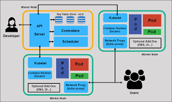

# Construisons ensemble de A à Z un cloud opensource pour le datascientist

## Contexte et objectif

Fred : présentation du contexte

## Socle : Kubernetes

Importance de la conteneurisation

## Provisionner un cluster kube

### `Théorie`

- Un prérequis : un cluster Kubernetes.
- "Agnostique de la distribution / cloud provider"
- Aujourd'hui : cluster managé chez OVH

### `Pratique`

- Création d'un cluster Kubernetes sur OVH

## Prise en main "admin" du cluster

### `Théorie`



- Interaction avec l'API Server

### `Pratique`

- Installation de `kubectl` (https://kubernetes.io/docs/tasks/tools/), attention au [Version skew policy](https://kubernetes.io/releases/version-skew-policy/) : respecter `+/- 1` par rapport au cluster pour éviter les problèmes. Le mettre dans le `PATH`.
- Téléchargement du `kubeconfig` depuis l'interface du provider (ou récupération en fonction de la distribution), le placer dans `~/.kube/config`
- Confirmer avec `kubectl get nodes` la présence des noeuds

## Datascience 101 : déploiement d'un service

### `Théorie`

- On a un cluster, on déploie et c'est fini, non ?

### `Pratique`

- Déploiement d'un jupyter notebook basique. `kubectl apply -f manifests/jupyter-basique`
- `kubectl get pods` pour suivre la création du pod
- `kubectl logs podname` une fois `Running` pour consulter les logs et récupérer le token d'accès (on ne l'a pas précisé donc il est généré dynamiquement à chaque lancement)
- `kubectl port-forward podname 8888:8888` pour ouvrir un tunnel entre `localhost:8888` et le port 8888 du Jupyter
- Accès et utilisation du Jupyter via `localhost:8888`

Superbe infra datascience :thumbsup:

## Packaging, reproductibilité et configuration : Helm

### `Théorie`

Intérêt du packaging, principes de Helm

### `Pratique`

Désinstallation et réinstallation du service précédent

- `kubectl delete -f manifests/jupyter-basique` pour nettoyer le service précédent
- Recherche d'un `chart` Helm pour jupyterlab ...
- https://github.com/inseefrlab/helm-charts-interactive-services

```
helm repo add helm-charts-interactive-services https://inseefrlab.github.io/helm-charts-interactive-services
helm repo update
helm install jupyter helm-charts-interactive-services/jupyter-python
```

- Pratique : faire un `chart` "coquille" avec une dépendance vers le `chart` réel (cf `manifests/jupyter-helm`)
- Bonne pratique : Utiliser `helm template` AVANT d'installer pour contrôler ce qui va être installé. (à défaut, `helm get manifest <releasename>` pour voir les manifests après installation)
- Bonne pratique : Externaliser les values dans un `values.yaml` (`helm install -f values.yaml`)
- Bonne pratique : `helm uninstall jupyter`

## Exposition des services vers l'extérieur

### `Théorie`

Enjeux d'un reverse proxy

### `Pratique`

- `cd manifests/ingress-nginx`, `helm dependencies build` pour télécharger les dépendances (`helm dependencies update` pour les mettre à jour)
- `helm template ingress-nginx . -f values.yaml` pour prévisualisation
- `helm install ingress-nginx . -f values.yaml` pour l'installation
- `kubectl get pods` pour suivre l'avancée des pods, `kubectl get service` pour suivre l'affectation de l'IP loadbalancer
- Récupérer l'IP externe (après affectation par le cloud provider)

### `Théorie`

Rappels DNS / HTTPS

### `Pratique`

- Configuration d'un champ DNS `A` `*.devoxx.insee.io` => `ipexterne`
- Modifier le jupyter pour utiliser le reverse proxy (ingress)

### `Théorie`

Certificat TLS : wildcard vs cert-manager

### `Pratique`

- Wildcard : `certbot certonly --manual --preferred-challenges dns`
- `kubectl create secret tls wildcard --key privkey.pem --cert cert.pem`
- Ou cert-manager : https://cert-manager.io/docs/installation/helm/

## Bilan d'étape

On a un cluster, accessible aux admins avec possibilité de déployer des services de façon technique.  
**Nécessité d'industrialisation et de proposer une UX**

## Onyxia, notre sauveur

Jo : vidéo + présentation de l'appli + démo sspcloud

## Installation d'Onyxia

### `Théorie`

Intérêt, fonctionnement

### `Pratique`

- https://www.onyxia.sh/

* `cd manifests/onyxia-brut`, `helm dependencies update`, `helm install onyxia . -f values.yaml`
* ...
* `https://datalab.devoxx.insee.io`

## Multi users : authentification

### `Théorie`

OIDC, présentation de keycloak


### `Pratique`

Installation et paramétrage de keycloak, onyxia avec authentification

## Stockage S3

### `Théorie`

- Fred : intérêt du stockage S3

### `Pratique`

Installation minIO et utilisation dans Onyxia

## Catalogue

### `Théorie`

- Jo : fonctionnement du catalogue

### `Pratique`

Création et utilisation d'un catalogue maison
